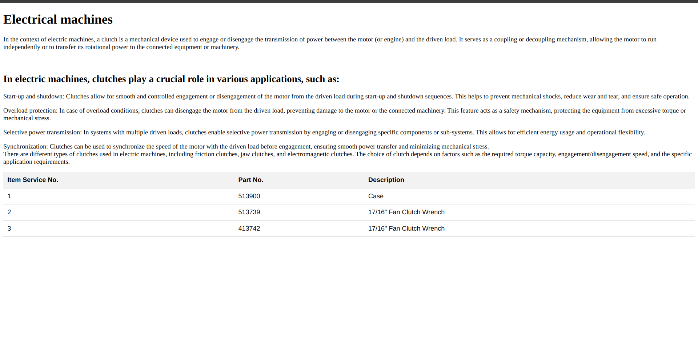
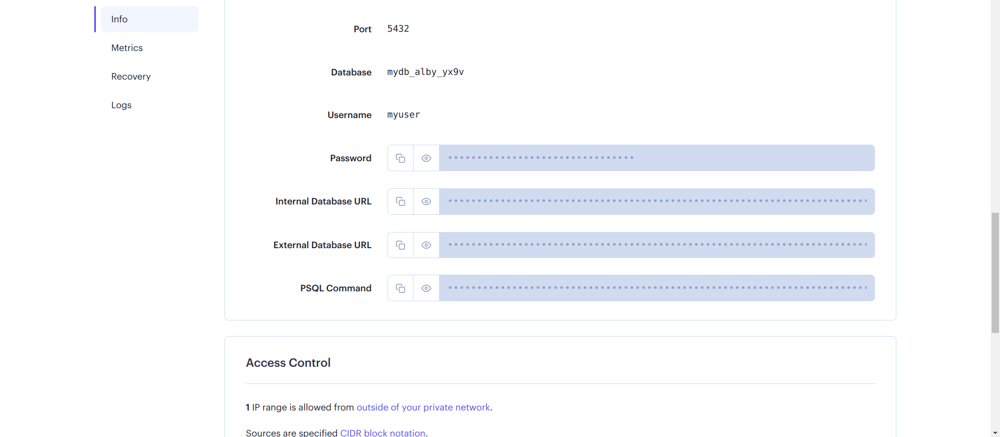
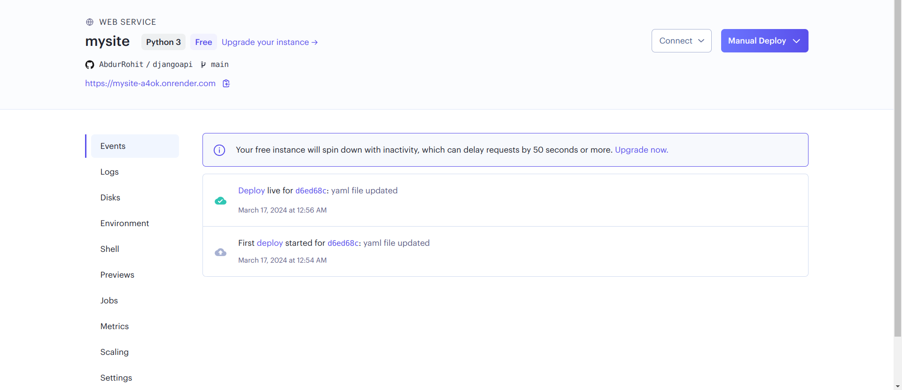

Intern Front-End Development Test: Electrical Machines Parameter Viewer

Project Overview:

You are tasked with building a web application using Angular that retrieves data from an API built with Django and MySQL. The application should allow users to view and search for electrical machines parameters.

Requirements:

1. Front-End Development:

* Implement an Angular web application with the following features:
* Display a list of electrical machines parameters retrieved from the API.
* Allow users to search for parameters based on their names or categories.
* Display detailed information about selected parameters.
* Ensure responsiveness and usability across different devices.

2. API Integration:

* Utilize an API built with Django and MySQL to retrieve data related to electrical machines parameters.
* Implement API calls to fetch parameter data and display it in the Angular application. - Done

3. Database Design: - Done

* Ensure the API is integrated with a MySQL database containing tables for storing electrical machines parameters.

4. Ubuntu OS Deployment: - Done

* Deploy the Angular application on an Ubuntu server.
* Ensure proper setup and configuration for smooth functioning of the application.

Instructions:

* Number of users : 10, Number of fields/columns for database: 5, Number of data/rows: 10
* Fork this GitHub repository: [Intern Front-End Development Test](https://github.com/vigneshranganathan/intern_front_end_development)
* Complete the tasks described above within 3 days.
* Ensure your code is well-structured, modular, and follows Angular best practices.
* Use Angular for front-end development and integrate it with the provided Django API.
* Deploy the application on an Ubuntu server (you can use any cloud provider or local setup).
* Once completed, submit your solution by sending a pull request to the main repository.

Evaluation Criteria:

Your solution will be evaluated based on the following criteria:

1. Functionality: Does the Angular application meet the specified requirements? Can users view, search, and access detailed information about electrical machines parameters?
2. Code Quality: Is the Angular code well-structured, readable, and maintainable? Are best practices followed?
3. API Integration: Are API calls implemented correctly to fetch data from the Django API? Is error handling implemented appropriately?
4. Database Design: Is the database schema well-designed and appropriate for storing electrical machines parameters? Are relationships between entities defined correctly?
5. Front-End Design: Is the user interface intuitive and visually appealing? Does it provide a smooth experience for viewing and searching parameters?
6. Ubuntu OS Deployment: Is the Angular application successfully deployed on an Ubuntu server? Is it accessible and functional?
7. Documentation: Is the code adequately documented? Are setup instructions provided for deployment on an Ubuntu server?

Note: If you encounter any issues or have questions during the test, feel free to reach out for clarification or assistance.

All the Best !!

